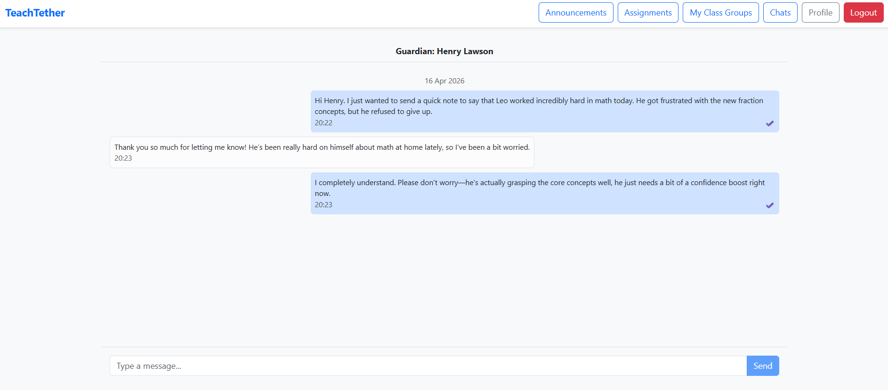
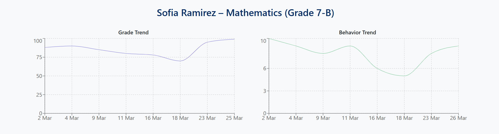
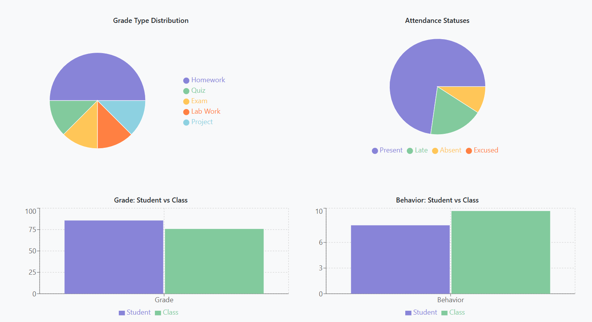
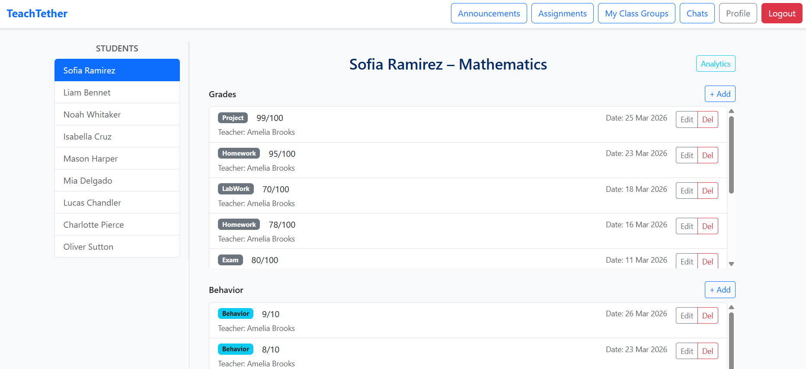
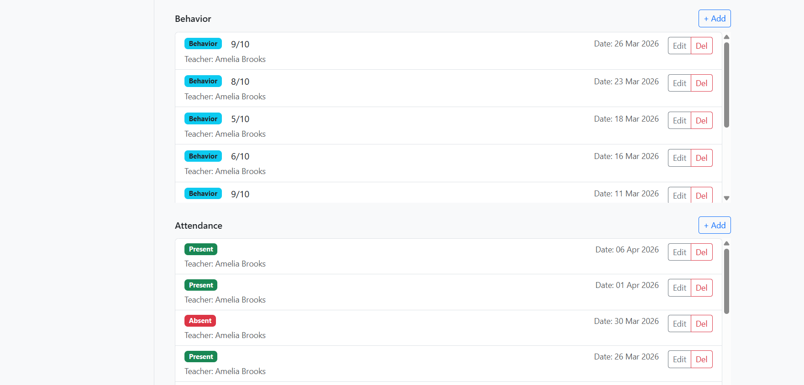
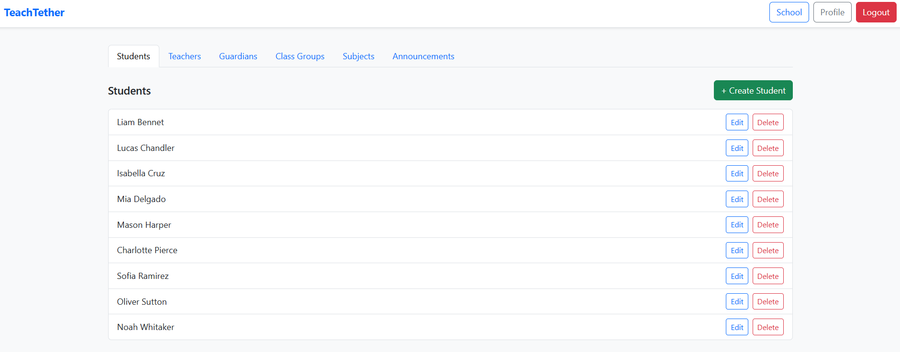

# 🎓 TeachTether Frontend

> **Backend API Repository:** This repository contains the React frontend application for TeachTether.

🔗 **Backend Repository:** [TeachTether Backend](https://github.com/Hikaaruu/TeachTether/)

## 📖 Overview
TeachTether is a multi-tenant, role-driven educational management platform. This repository contains the modern single-page application designed to serve five distinct user types: School Owners, Administrators, Teachers, Students, and Parents.

Engineered with **React** and **TypeScript**, the application abstracts complex relational data into intuitive, responsive dashboards. It features a custom role-based routing architecture, real-time WebSocket integrations for instant communication, and interactive data visualizations for academic analytics.

---

## ✨ Key Capabilities

* 🛂 **Dynamic Role-Based UI:** Implements strict layout segregation and protected routing to ensure users only access features and data pertinent to their authorization level.
* 💬 **Real-Time Communication:** Integrates a robust SignalR client to power seamless, instant messaging between teachers and parents.
* 📊 **Interactive Analytics Dashboards:** Transforms raw backend data into actionable insights using rich, component-based charts.
* 🔐 **Secure State Management:** Manages JWT authentication states, secure token storage, and automatic HTTP request interception via a centralized API client.
* 🧩 **Custom React Hooks:** Encapsulates complex business logic and state management to keep UI components pure, testable, and strictly focused on rendering.
* ✅ **Client-Side Validation:** Provides immediate, strongly-typed feedback on forms and user inputs before communicating with the API.

---

## 📸 Application Interface

### Real-Time Messaging Hub

*SignalR-powered live chat allowing teachers and guardians to communicate instantly.*

### Interactive Student Analytics


*Dynamic visualization of student results.*

### Comprehensive Student Results


*A consolidated view of student academic performance, featuring role-based access control that allows teachers to securely add or modify grades and attendance.*

### Role-Based Navigation

*The system dynamically renders completely different dashboards and navigation trees based on the authenticated user's role.*

---

## 🛠 Tech Stack

**Core Framework**
* **React 19**
* **TypeScript**
* **Vite** 

**UI & Styling**
* **Bootstrap** + **React Bootstrap** - component library and styling
* **Recharts** — data visualisation charts

**Architecture & Routing**
* **React Router**
* Context API (Authentication state management)

**Data & Integration**
* **Axios / Fetch API** (Wrapped in a custom `client.ts` for interceptors)
* **@microsoft/signalr** (WebSocket client for real-time chat)


---

## 🧱 Project Structure

The application follows a feature-driven, modular architecture to maintain scalability as the platform grows:

* **`/src/api`**: Centralized HTTP clients and SignalR WebSocket connections.
* **`/src/auth`**: JWT token storage, retrieval, and the global AuthProvider context.
* **`/src/components`**: Reusable UI primitives and domain-specific segments.
* **`/src/hooks`**: Custom React hooks handling complex data fetching and component lifecycles.
* **`/src/layouts`**: Top-level wrappers dictating the navigation and structure for specific user roles.
* **`/src/pages`**: The main route components (Dashboard, Grading, Messages, etc.).
* **`/src/routes`**: Logic for route protection, role verification, and navigation mapping.

---

## 🚀 Getting Started

### Prerequisites
* [Node.js](https://nodejs.org/) (v18 or higher recommended)
* A running instance of the [TeachTether Backend API](https://github.com/Hikaaruu/TeachTether/) on `https://localhost:7054`
* **npm** or other compatible package manager

### 1. Clone the repository

```bash
git clone https://github.com/Hikaaruu/TeachTether.Frontend.git
cd TeachTether.Frontend
```

### 2. Install dependencies

```bash
npm install
```

### 3. Start the development server

```bash
npm run dev
```

The app runs on `https://localhost:5173` by default. The dev server proxies `/api` and `/hubs` requests to the backend at `https://localhost:7054`.

### 4. Build for production

```bash
npm run build
```

Output is placed in the `dist/` directory.
